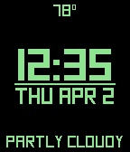
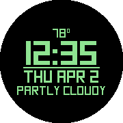
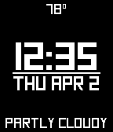

# Square - A Watchface for the Pebble Smartwatch
by Turner Vink  
www.turnervink.com

## Features
- Offline configuration with Clay
- Optional weather in four languages (English, French, Spanish, and German)
- Two date formats (THU APR 2, THU 2 APR)
- Pick text and background colours on Basalt and Chalk
  - Invert colour scheme on Aplite and Diorite
- Seconds
- Middle bar can be static, show battery level, or track steps\*
  - Choose an automatic goal to beat yesterday's steps, or set your own
- Choose different colours at night
- Bluetooth status indicator/vibration

\* Health features available on Basalt, Chalk, and Diorite
